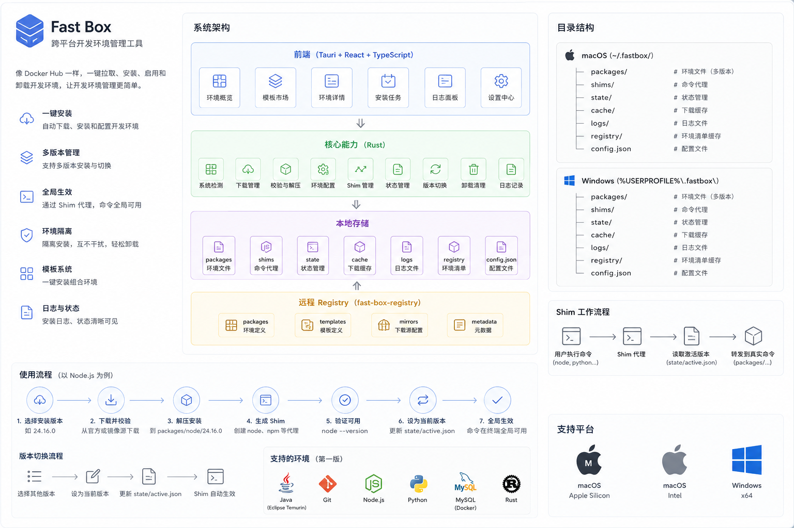

# Fast Box 📦

Fast Box 是一个现代化的、跨平台本地开发环境与多版本管理工具。它旨在让开发者能够在一个隔离的沙箱目录（`~/.fastbox`）中，一键下载、安装、管理与切换多套开发环境工具链（如 Node.js、Go、Python 等），并通过轻量级的命令行垫片（Shim）实现零侵入、无痛的版本切换。

本项目拥有精美现代的极简主义大厂风格界面，并配备了用于维护注册表和软件包的**管理后台系统**。

---

## 🏗️ 架构设计

Fast Box 采用客户端核心与注册表后台管理分离的设计，客户端通过 Tauri 进行底层跨平台 Rust 调用，而配置后台通过 Express API 实现 JSON 注册表的动态生成。

### 系统架构图



### 核心工作原理

1. **环境隔离**：所有语言包与工具均下载并解包于 `~/.fastbox/packages/<name>/<version>/` 目录下，互不干扰，保持宿主系统干净。
2. **命令垫片（Shim）**：当用户切换版本时，Fast Box 会在 `~/.fastbox/shims/` 下生成代理可执行文件或脚本。用户只需将该 `shims` 目录加入系统环境变量 `PATH`，即可全局使用当前激活的环境，无需每次修改系统环境变量。
3. **状态管理**：活动版本由 `~/.fastbox/active.json` 全局记录。垫片通过读取此配置文件，动态转发命令到对应的真实语言包目录。
4. **动态注册表**：客户端实时扫描 `fast-box-registry/packages/` 目录下的 JSON 配方配置，做到配方文件热更新，客户端零打包即可生效。

---

## ✨ 核心特性

- 🚀 **跨平台多版本管理**：支持 Windows、macOS (Intel & Apple Silicon) 与 Linux。
- ⚡ **无缝命令垫片 (Shim)**：通过统一垫片动态路由，版本秒级切换。
- 📦 **开箱即用多环境**：支持 Node.js，未来可轻松扩展至 Go、Python、Rust 等。
- 🔍 **环境健康自检**：自动执行预设脚本（如 `node --version`）验证安装完整性。
- 🌐 **多源镜像支持**：内置国内淘宝镜像等源，解决网络下载痛点。
- 🖥️ **精美 UI/UX 设计**：采用大厂级极简亮色主题，极致流畅的交互体验。
- 🛠️ **配套管理后台**：可视化管理注册表、添加新包、配置多平台包文件名、校验指令及镜像源。

---

## 📂 项目结构

```text
Fast Box/
├── src-tauri/               # Tauri Rust 客户端后端核心
│   ├── src/
│   │   ├── main.rs          # 应用入口与 Tauri 命令注册
│   │   ├── commands.rs      # 前端 Tauri IPC 命令接口实现
│   │   ├── system.rs        # 系统/架构检测及基础路径初始化
│   │   ├── registry.rs      # 注册表 JSON 读取器
│   │   ├── download.rs      # 异步 HTTP 下载（带进度回调）
│   │   ├── extract.rs       # 压缩包解压（tar.xz, zip 等）
│   │   ├── state.rs         # 活动环境 active.json 读写器
│   │   ├── shims.rs         # 平台垫片（Shim）生成器
│   │   ├── verify.rs        # 执行自检与校验验证器
│   │   └── utils.rs         # 工具辅助函数
│   ├── Cargo.toml           # Rust 依赖声明
│   └── tauri.conf.json      # Tauri 配置文件
├── src/                     # 客户端 React 前端 (TypeScript + Tailwind)
│   ├── components/          # 通用 UI 组件 (布局、进度条、日志面板等)
│   ├── pages/               # 页面模块 (概览 Home, 环境列表, 详情, 设置)
│   ├── App.tsx              # 路由与导航主体
│   └── index.css            # 基础样式与 Tailwind 引入
├── fast-box-admin/          # 注册表管理后台项目
│   ├── src/                 # 后台 React 前端
│   │   ├── pages/           # 仪表盘、包列表、配方编辑器、镜像管理器
│   │   └── main.tsx         # 挂载入口
│   ├── server.js            # Express API 本地后台 (绕过沙箱读写本地 JSON)
│   ├── package.json         # 管理后台依赖与并发启动命令
│   └── vite.config.ts       # Vite 配置及 API 代理转发
├── fast-box-registry/       # 本地开发包注册表 JSON 存储库 (Git 子模块/目录)
├── docx/                    # 相关文档与架构资产目录
└── package.json             # 客户端前端与 Tauri 运行主配置文件
```

---

## 🚀 快速开始

### 依赖环境

- [Node.js](https://nodejs.org/) (建议 v18+)
- [pnpm](https://pnpm.io/) 包管理器
- Rust 工具链 (可通过 [rustup](https://rustup.rs/) 安装，Tauri 开发必须)

### 1. 运行 Fast Box 桌面客户端

1. **安装依赖**：
   在项目根目录下执行：
   ```bash
   pnpm install
   ```

2. **启动 Tauri 开发服务器**：
   ```bash
   pnpm tauri dev
   ```
   该命令会启动 React 前端并自动唤起编译好的 Tauri 桌面窗口。

### 2. 运行 Fast Box 管理后台

管理后台用于可视化管理软件包的注册信息（保存在 `fast-box-registry/packages/` 中）。

1. **进入管理后台目录**：
   ```bash
   cd fast-box-admin
   ```

2. **安装依赖**：
   ```bash
   pnpm install
   ```

3. **启动开发与 API 服务**：
   ```bash
   pnpm dev
   ```
   此命令会并行启动 Express 服务（3001 端口）和 Vite 网页服务（5174 端口）。
   
4. **访问后台**：
   在浏览器中打开：👉 [http://localhost:5174](http://localhost:5174)

---

## 🛠️ 技术选型

- **客户端外壳**：Tauri v1 / Rust
- **前端框架**：React 18 + TypeScript
- **样式系统**：Tailwind CSS (Vanilla Tailwind & CSS)
- **管理端后台服务**：Node.js + Express
- **包管理器**：pnpm

---

## 📄 授权协议

[MIT License](LICENSE)
